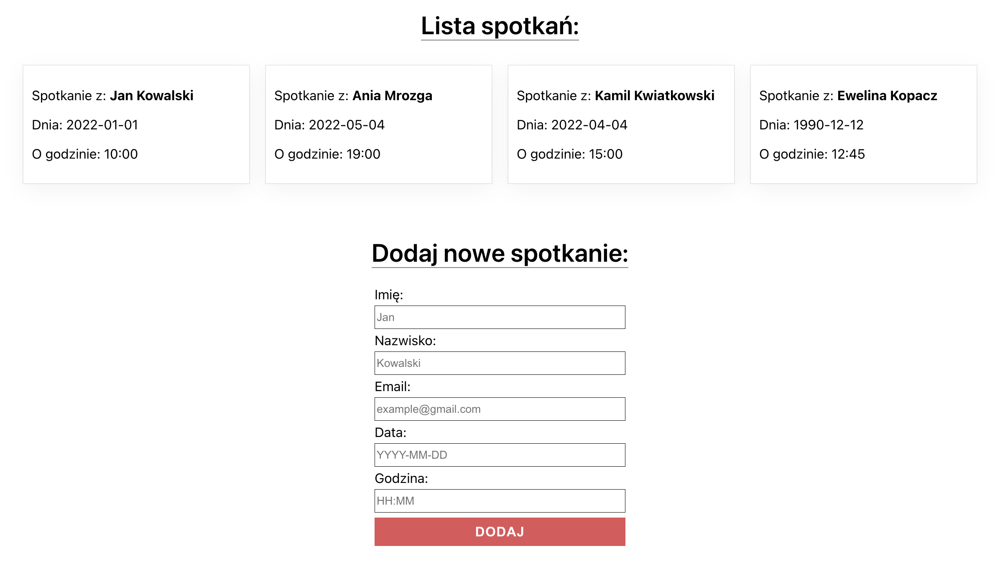
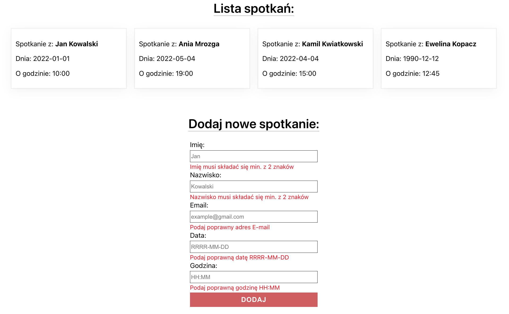

# Meeting Calendar Project - React

## About the project:
The aim of the project was to create application "Meeting Calendar" using React library. While working on this project I have tried to split the code into components - it was required. To create my application I used "Create React App"  ready templated.

Features:
* user can add a new meeting by form giving:
    * first name
    * last name
    * email
    * meeting day
    * meeting hour

Each field is reguired and data is check when user click the button "Dodaj". If the data is invalid, user will see the error.

* correct data is saving into .json file. I am using local API - JSON server
* a new meeting is added to the list
* after start project and JSON server, data (meeting list) is loaded 


## How to see it
Please, refer to the screenshots, which are attached below. Moreover, I am working on a form of a video preview as an additional reference guide.

## Technologies:
* JavaScript
* React
* HTML
* CSS
* JSON Server
* Desktop only version

## Solutions
When creating this project I had an opportunity to practice/learn:
* how to build application using composition and components - nested components.
* dependence between parent and children component - communication
* React Developer Tool

I have created one "big" compontent ```<Calendar/>``` which includes:
* state: meetings array
* functions
* components such as:
    * ```<CalendarForm/>```
    * ```<CalendarList/>``` include another component: ```<CalendarItem/>``` 

I have used props to transfer functions and data to the "children" components

* I created another one ```<CalendarProvider/>``` component, to connect with API: load and add meetings

## Development
I am going to develop application by adding additional functionalities such as:
* remove a meeting
* edit a meeting
* sort meetings
* component to confirm added a meeting
* better design

Right now, I can provide my other projects where I focused more on design and practiced CSS3.
* [LandingPage-HTML-CSS](https://github.com/EwelinaKopacz/LandingPage-HTML-CSS)
* [LandingPage-RWD](https://github.com/EwelinaKopacz/LandingPage-RWD)
* [LandingPage-CuDanusie](https://github.com/EwelinaKopacz/LandingPage-CuDanusie)


### Project preview
List of meetings


Form with errors


### Feel free to contact me:
* [Linkedin](https://www.linkedin.com/in/ewelina-kopacz-929559100/) - Ewelina Kopacz

### Thanks for project and support to Mateusz Bogolubow:
* Mentor i Trener Programowania JavaScript - [DevMentor](https://devmentor.pl/) - Mateusz Bogolubow